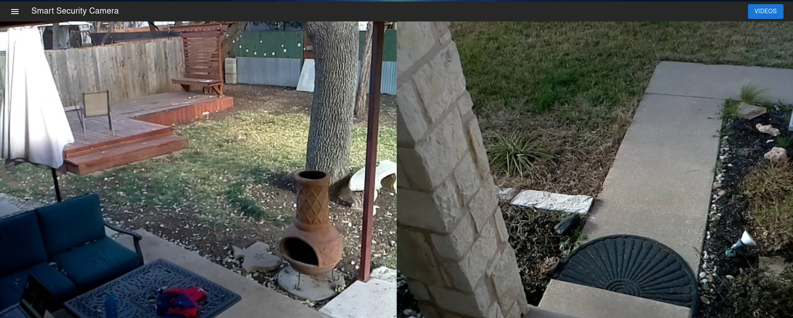
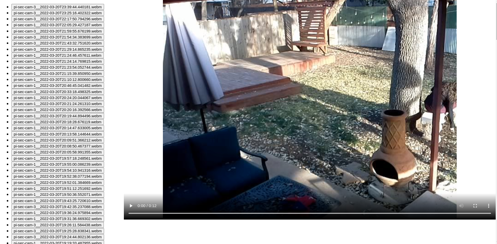

# Self-Hosted Home Security Camera System

A privacy-focused, intelligent security camera system.

## Features:
- Multi-camera support w/ minimal configuration. Supports USB cameras and the Raspberry Pi camera module.
- Motion detection that automatically saves videos and lets you view them in the web app.
- Encrypted in transit, both from the cameras to the server and the server to your browser.
- Self-Hosted
- Free and Open Source

## Example screenshots

## Setting up the server

#### Docker:
1. Clone this repository
2. Generate SSL certificates: `./create-certs.sh`. Alternatively, you may place your own certs in the `certs` dir
3. Build and run the docker containers: `API_URL=<server-hostname:server-port> docker-compose up -d --build`. 
For example, if the API was running on the host `sec-cam-server` and port 8444, you should use `API_URL=sec-cam-server:8444`

## Adding a camera

#### Installation:

NOTE: These instructions assume you are deploying to a raspberry pi running Raspbian OS.

0. Install the `python3-opencv` package and dependencies: `sudo apt-get install python3-opencv libatlas-base-dev`
1. Clone this repository
2. Install the package: `cd backend && python3 -m pip install .[streamer]`. If you are using the Raspberry Pi camera
module, run `cd backend && python3 -m pip install .[streamer,picam]`.
3. Update `--server_url` in `run.sh` to point at the host you deployed the server to.
4. In the Web UI, you should see live video from that camera.
